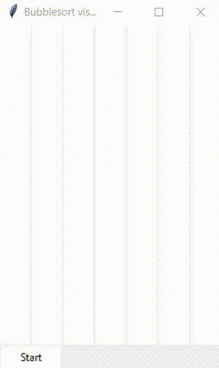

# BubblesortVisualizer
A GUI based bubblesort visualizer made using Tkinter.

## Setup ##
#### Importing ####
```python
from src.bubblesortvisualizer import BubbleSorter
```
#### Object parameters of `BubbleSorter` ####
- Maximum size of an element.
- Number of elements.
- Sleep time while running the algorithm.
```python
if __name__ == "__main__":
    win = BubbleSorter(10, 7, 0.2)
```

## Running ##
On running, a window will open.  
Click the ***Start*** button to create an array of random elements and sort them.

## Demo ##

- ***Purple*** color represents unsorted elements.
- ***Navy*** color represents the elements which are being currently compared.
- ***Green*** color represents the elements which have been sorted.  
